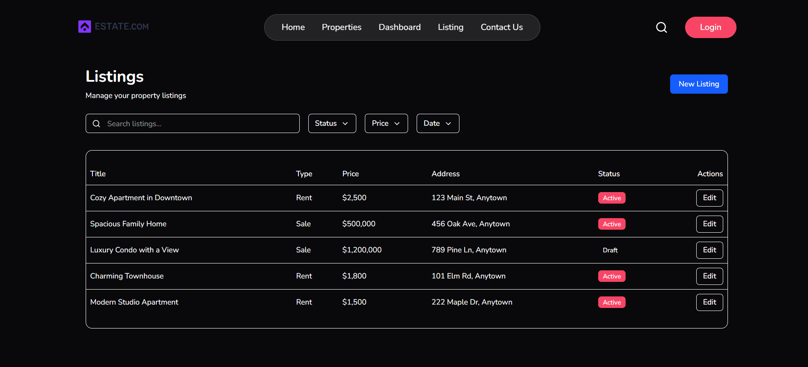

# Real Estate Listing Manager 🏠

This is the frontend repository for a real estate listing manager application. This application allows property owners to list their properties for rent or sale and prospective tenants/buyers to browse, filter, and inquire about those properties.

## 🚀 Features

- **Responsive Design**: Optimized for all devices, from desktops to mobile phones.

- **Property Listings**: Add, edit, and manage detailed property information including images, price, and description.

- **Advanced Search & Filters**: Easily find properties based on location, price, type, and more.

- **Property Booking/Inquiry**: Users can request viewings or send inquiries directly to property owners.

- **User Management**: Manage property owners, tenants, and admin users.

- **Dashboard**: Get a real-time overview of platform activity with metrics such as:
  - Total Properties
  - Active Listings
  - User Engagement Stats

- **Role-Based Authentication**: Secure access with different permissions for Admins, Owners, and Tenants.

## Tech Stack

### Frontend
- **React 19** - A JavaScript library for building user interfaces.
- **Vite** - A fast build tool for modern web projects.
- **React Router DOM** - For client-side navigation.
- **Tailwind CSS** - Utility-first CSS framework for styling.
- **Axios** - For API communication.
- **Date-fns** - For date formatting and manipulation.
- **Lucide-react** - Icon library.
- **React-hot-toast** - For notifications.


## Screenshots

## Screenshots



## Project Installation

#### Clone the project

```bash
git clone https://github.com/Sonuku4564/Real-Estate-Listing-Manager.git

```

### Frontend Setup

Follow these steps to get the frontend running:

1.  **Navigate back to the project root and then into the `frontend` directory:**
    ```bash
    cd Real-Estate-Listing-Manager

    ```

2.  **Install dependencies:**
    ```bash
    npm install
    ```

3.  **Start the frontend development server:**
    ```bash
    npm run dev

    ```

## License

This project is licensed under the [ MIT License.](https://choosealicense.com/licenses/mit/)

